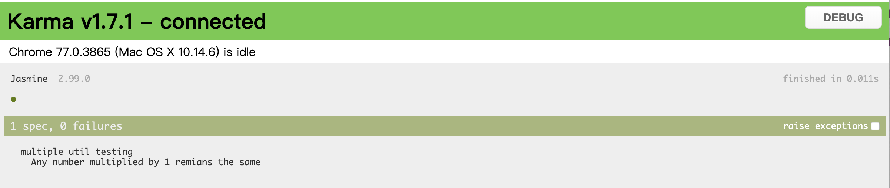
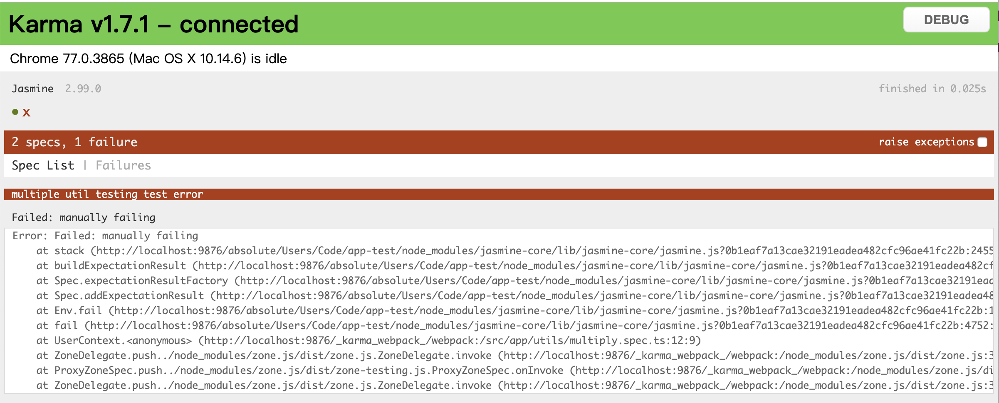

# Jasmine 语法入门 part I

在前一篇文章中，基本了解了整个测试文件的结构，也写了一个极简的测试用例，接下来具体的了解以下Jasmine的语法，来看之前写的那个简单的测试用例：
```
it('should return sum of two',()=>{
    let result = Convert.sum(1, 2);
    expect(result).toEqual(3);
});
```
整个测试用例的代码包含在一个it方法中：
* 其中，第一个参数是string类型的description，用来描述该测试用例的目的；
* 第二个参数接受一个回调，即具体的测试执行代码；
* it方法可接收number类型的值作为第三个参数，用来设置setTimaOut，使代码延时执行。

## Ecpectation
整个测试用例最复杂的测试逻辑，都包含在第二个回调中，我们可以尝试从语意角度分析一个测试用例。在每个测试用例中，都会包含一个测试期望，通过一个expect操作符开始，在上述代码中```expect(result).toEqual(3)```就是一个期望；一个期望有包含三个部分：
1. current value：即expect函数接受的值，上述的result，即为实际值；
2. matcher：可以将其称之为匹配器，每个匹配器实现实际值和期望值之间的布尔比较，比较结果即为该测试pass or fail的结果，如上述的toEqual方法；另外，每个matcher前都可通过.not链接变为否定断言，如```expect(result).not.toEqual(3)```。jasmine提供了很全面的matcher，如not/toBe/noting/toBeCloseTo/toBeFalse等等，具体查阅官方[API](https://jasmine.github.io/api/edge/matchers.html)，也可根据自己的需要，自定义matcher。
3. expect value：即为期望的运行结果。

## before & afrer
要相对一个组件或一部分功能做全面的测试，通常我们针对其写构造个单元测试，如测试一个DOM的显示的宽、高及颜色，我们需要分别构造三个单元测试，每个测试测试中都要拿到当前的DOM对象，通常这种情况下，重复的代码就会出现。
为了防止在测试中出现大量重复的代码，jasmine专业提供了全局的[beforeEach](https://jasmine.github.io/api/edge/global.html#beforeEach)/[afterEach](https://jasmine.github.io/api/edge/global.html#afterEach)/[beforeAll](https://jasmine.github.io/api/edge/global.html#beforeAll)/[afterAll](https://jasmine.github.io/api/edge/global.html#afterAll)方法，根据字面意思即可理解，beforeEach和afterEach会分别在每个测试用例执行的前、后分别执行，而beforeAll和afterAll会在整个测试结合执行前、后执行。
简单改造convert.spec.ts的测试代码，观察上述代码的执行顺序：
```
describe('convert util testing', ()=>{
    beforeAll(() => {
        console.log('before all')
    }),
    beforeEach(() => {
        console.log('before each')
    }),
    afterEach(() => {
        console.log('after each')
    }),
    afterAll(() => {
        console.log('after all')
    }),
    it('should return sum of two',()=>{
        let result = Convert.sum(1, 2);
        console.log('unit spec1');
        expect(result).toEqual(3);
    });
    it('should return a - b', ()=>{
        let result = Convert.sum(1,-1);
        console.log('unit spec2');
        expect(result).toEqual(0);
    })
})
```
控制台中的输出结果：
 

## this
同时，jasmine提供了this关键字作为全局变量，通过this关键字，可以在it/beforeEach/afterEach等方法中共享变量。
通过一个简单的例子进行测试，我们在arc/app/utils文件夹中分别创建multiply.ts和multiply.spec.ts文件，分别写入如下代码：
```
// multiply.ts
export class Multiply {
    public static multiply(x: number, y:number){
        return x*y;
    }
}
```
```
// multiply.spec.ts
import { Multiply } from './multiply';

describe('multiple util testing', ()=>{
    beforeAll(function(){
        this.value = 1;
    });
    it('Any number multiplied by 1 remians the same',function(){
        let result = Multiply.multiply(this.value, 3);
        expect(result).toEqual(3);
    });
})
```
上述代码实现一个简单的乘法，以及通过this对象进行数值的传值，测试1 * 3 = 3，单独运行这个测试代码,我们得到如下测试结果：
 

## fail
有些情况下，一些单元测试需要覆盖程序执行失败时的情况，如测试一些错误信息是否显示，这是，我们可以通过fail方法使测试结果变成failing。我们对上述的multiply.spec.ts文件做如下改动，添加一个test error的用例：
```
describe('multiple util testing', ()=>{
    beforeAll(function(){
        this.value = 1;
    });
    it('Any number multiplied by 1 remians the same',function(){
        let result = Multiply.multiply(this.value, 3);
        expect(result).toEqual(3);
    });
    it('test error',function(){
        fail('manually failing')
    });
})
```
运行测试结果，显示如下：
 

## describe的嵌套
describe方法内部可以嵌套多层子describe，当需要测试的动能复杂时，通过嵌套，可以很好的划分测试逻辑；同样，每个describe方法有其独立的作用域，各自的全局方法或独行保持相互独立。对上述的multiply.spec.ts文件做如下改动，添加子describe，并同样通过this.value传递数值：
```
describe('multiple util testing', ()=>{
    beforeAll(function(){
        this.value = 1;
    });
    it('Any number multiplied by 1 remians the same',function(){
        let result = Multiply.multiply(this.value, 3);
        expect(result).toEqual(3);
    });
    
    // it('test error',function(){
    //     fail('manually failing')
    // });

    describe('nested inside a second describe', function(){
        beforeAll(function(){
            this.value = 0;
        });
        it('Any number multiplied by 0 equals to 0',function(){
            let result = Multiply.multiply(this.value, 3);
            expect(result).toEqual(0);
        });
    })
})
```
在测试结果报告中，describe的层级关系通过行缩进的方式展现出来，测试结果如下：
 

## xdescribe & xit
在某些情况下，我们需要暂时禁用一些测试用例，可以通过x前缀进行控制，通过xdescribe可已经整个测试单元禁用，包括其内部的测试用例；而xit可以针对每个测试用例进行disable操作。禁用后可以在控制台输出中看到如下结果(最后一行，显示skipped 2)：


## [<< 1. Angular Test Basic](../../../README.md)


